# Google App Engine - First Project Walkthrough

A complete step-by-step guide to creating and deploying your first application on Google App Engine.

## Table of Contents
1. [Setting Up App Engine](#1-app-engine-welcome)
2. [Creating Your Application](#2-creating-the-app-engine-application)
3. [Configuring Service Account](#3-service-account-selection)
4. [Application Creation in Progress](#4-application-creation)
5. [Getting Started with Deployment](#5-deployment-options)
6. [Installing Google Cloud SDK](#6-cloud-sdk-overview)
7. [Extracting Cloud SDK](#7-extracting-the-sdk)
8. [Running SDK Installation](#8-sdk-installation-script)
9. [SDK Components](#9-sdk-components-overview)
10. [Path Configuration](#10-configuring-shell-path)
11. [Authentication Success](#11-authentication-complete)
12. [Cloud Shell Welcome](#12-cloud-shell-introduction)
13. [Initializing gcloud](#13-gcloud-initialization)
14. [Creating main.py](#14-creating-the-application-code)
15. [Creating requirements.txt](#15-defining-dependencies)
16. [Creating app.yaml](#16-app-engine-configuration)
17. [Running gcloud init](#17-starting-gcloud-init)
18. [Authenticating gcloud](#18-gcloud-authentication)
19. [Setting Project ID](#19-configuring-project-id)
20. [Project Configuration Confirmed](#20-project-set-successfully)
21. [Navigating to Project Directory](#21-accessing-project-folder)
22. [Deploying to App Engine](#22-deployment-process)
23. [Accessing the Deployed App](#23-app-url-in-browser)
24. [Application Running](#24-hello-world-success)
25. [Viewing Versions](#25-app-engine-versions-dashboard)
26. [Application Settings](#26-app-engine-settings)
27. [Disabling the Application](#27-disable-confirmation)
28. [Application Disabled](#28-disabled-state)

---

## 1. App Engine Welcome


**What's happening:**
- You've navigated to the Google Cloud Console's App Engine Dashboard
- The welcome screen introduces App Engine as a platform to "Build scalable apps in any language on Google's infrastructure"
- The interface shows various sections in the left sidebar: Services, Versions, Instances, Task queues, Cron jobs, Firewall rules, Quotas, Memcache, and Settings
- Google is promoting Cloud Run as a modern alternative with lower minimum billable times and GPU support for AI/ML workloads

**Key Point:** This is the starting point for creating your first App Engine application.

---

## 2. Creating the App Engine Application

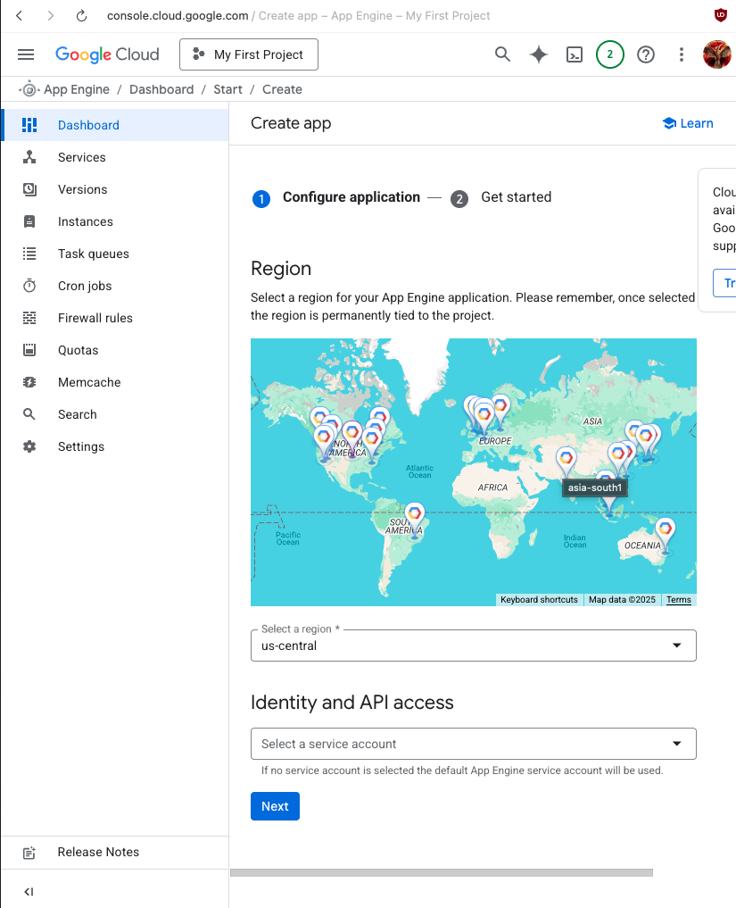

**What's happening:**
- You've clicked to create a new App Engine application
- The configuration wizard shows two main steps: "Configure application" and "Get started"
- **Critical Decision:** You must select a region for your App Engine application
- **Important Warning:** "Once selected, the region is permanently tied to the project" - this cannot be changed later!
- You also need to configure Identity and API access by selecting a service account

**Action Required:** Select your preferred geographic region from the dropdown menu.

---

## 3. Service Account Selection

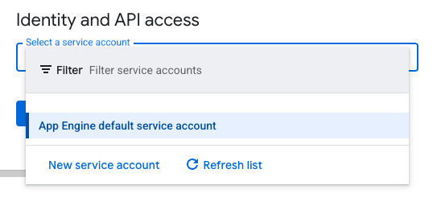

**What's happening:**
- A modal dialog has appeared to select a service account
- You can see the "App Engine default service account" option
- Options available:
  - Use the default App Engine service account
  - Create a new service account
  - Refresh the list to see other available service accounts

**Key Point:** Service accounts define the identity and permissions your App Engine application will use when accessing other Google Cloud resources.

---

## 4. Application Creation

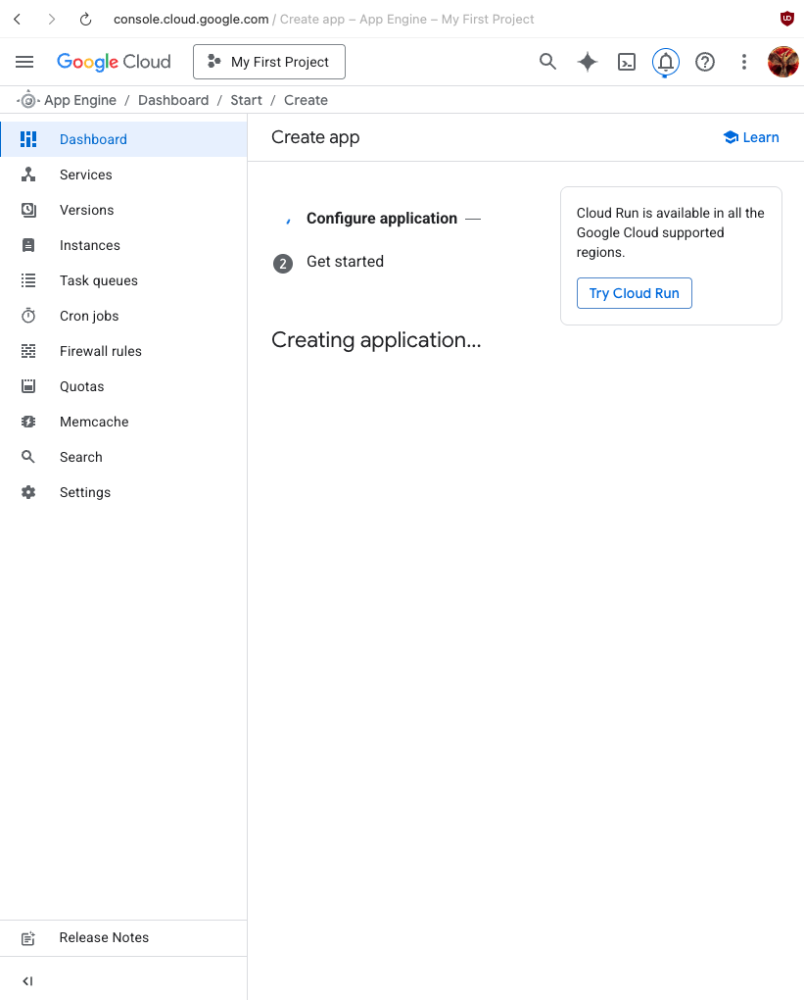

**What's happening:**
- The application is being created - you can see "Creating application..." with a loading spinner
- The screen shows a promotion for Cloud Run, mentioning it's "available in all the Google Cloud supported regions"
- The creation process happens in the background and may take a few moments

**Status:** Wait for the application creation to complete.

---

## 5. Deployment Options

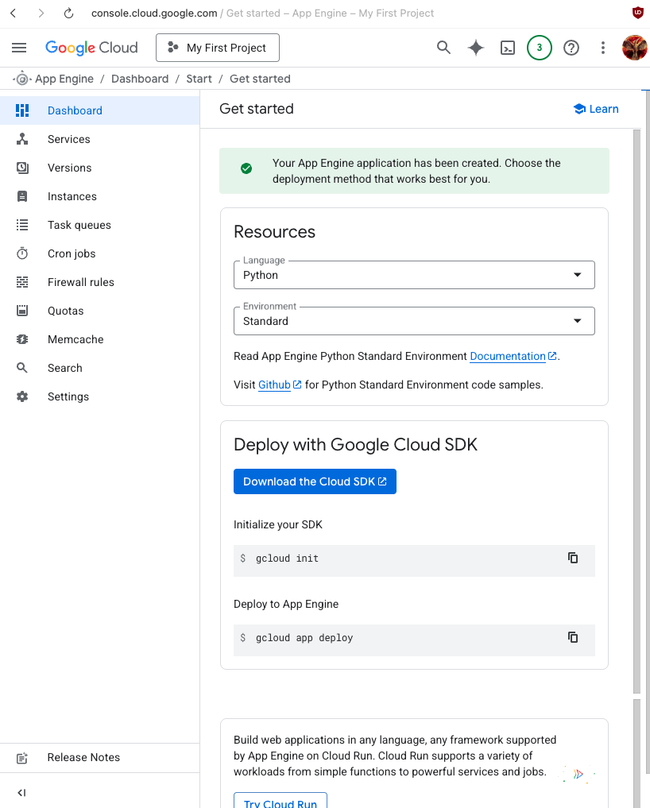

**What's happening:**
- Success! "Your App Engine application has been created"
- Now you're presented with deployment options:
  - **Language:** Python (selected)
  - **Environment:** Standard (selected)
- Resources provided:
  - Link to App Engine Python Standard Environment Documentation
  - GitHub samples for Python Standard Environment
- **Deployment instructions** shown for using Google Cloud SDK:
  ```bash
  gcloud init           # Initialize your SDK
  gcloud app deploy     # Deploy to App Engine
  ```

**Next Step:** You need to install the Google Cloud SDK to deploy your application.

---

## 6. Cloud SDK Overview


**What's happening:**
- You've navigated to the Google Cloud SDK page at cloud.google.com
- The page describes Cloud SDK as "Libraries and tools for interacting with Google Cloud products and services"
- Key features listed:
  - Client Libraries for Java, C++, Python, Node.js, Ruby, Go, .NET, PHP, Rust, and ABAP
  - Google Cloud CLI for scripting and interacting with cloud resources
  - Local development emulators for Pub/Sub, Spanner, Bigtable, and Datastore
- A video explaining "What is the Google Cloud SDK?" is available

**Action Required:** Download and install the Google Cloud CLI for your operating system.

---

## 7. Extracting the SDK

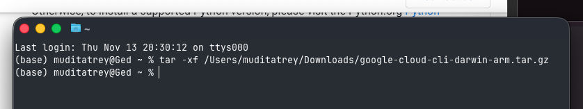

**What's happening:**
- You've downloaded the Google Cloud SDK (specifically the Darwin ARM version for macOS)
- Running the command in Terminal:
  ```bash
  tar -xf /Users/muditatrey/Downloads/google-cloud-cli-darwin-arm.tar.gz
  ```
- This extracts the SDK archive to create a `google-cloud-sdk` directory in your home folder

**Technical Note:** The extraction creates the necessary file structure for the Cloud SDK installation.

---

## 8. SDK Installation Script

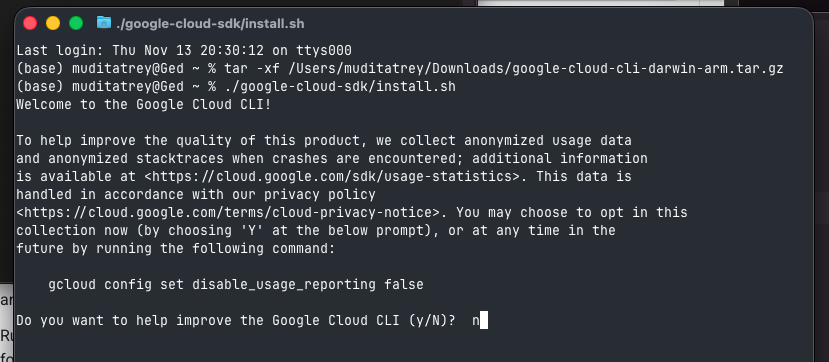

**What's happening:**
- Running the installation script:
  ```bash
  ./google-cloud-sdk/install.sh
  ```
- The installer asks: "Do you want to help improve the Google Cloud CLI (y/N)?"
- This is about **anonymized usage data and crash reports** collection
- The user has chosen "n" (no) to opt out of data collection
- You can change this later with: `gcloud config set disable_usage_reporting false`

**Privacy Note:** This is optional and doesn't affect SDK functionality.

---

## 9. SDK Components Overview

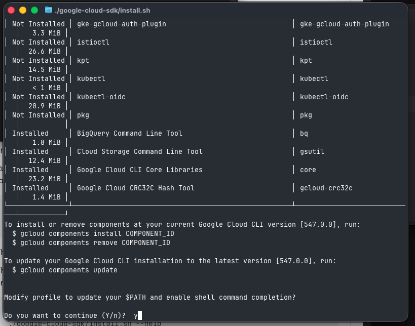

**What's happening:**
- The installer displays all available SDK components:
  - **Not Installed:** Various optional tools like `gke-gcloud-auth-plugin`, `istioctl`, `kpt`, `kubectl`, `kubectl-oidc`, `pkg`
  - **Installed by default:**
    - BigQuery Command Line Tool (`bq`) - 1.8 MiB
    - Cloud Storage Command Line Tool (`gsutil`) - 12.4 MiB
    - Google Cloud CLI Core Libraries (`core`) - 23.2 MiB
    - Google Cloud CRC32C Hash Tool (`gcloud-crc32c`) - 1.4 MiB

**Management Commands:**
```bash
gcloud components install COMPONENT_ID   # Install components
gcloud components remove COMPONENT_ID    # Remove components
gcloud components update                 # Update to latest version
```

---

## 10. Configuring Shell Path


**What's happening:**
- The installer asks: "Modify profile to update your $PATH and enable shell command completion?"
- User response: "y" (yes)
- The installer prompts: "Enter a path to an rc file to update, or leave blank to use [/Users/muditatrey/.zshrc]:"
- Since the user is on macOS using zsh shell, the default `.zshrc` is appropriate

**Important:** This modification allows you to run `gcloud` commands from anywhere in your terminal without specifying the full path.

---

## 11. Authentication Complete

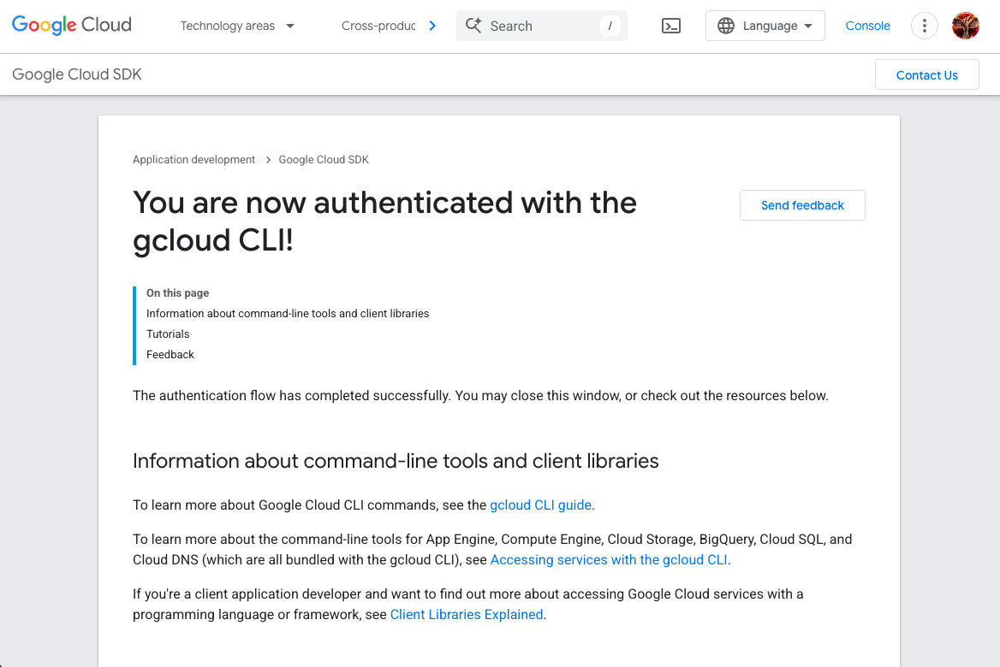

**What's happening:**
- Browser window showing: "You are now authenticated with the gcloud CLI!"
- The OAuth authentication flow has completed successfully
- The page provides helpful resources:
  - gcloud CLI guide for command-line tools
  - Information about accessing services with the gcloud CLI
  - Client Libraries documentation for programming language integration

**Status:** Your local machine is now authorized to interact with your Google Cloud project.

---

## 12. Cloud Shell Introduction

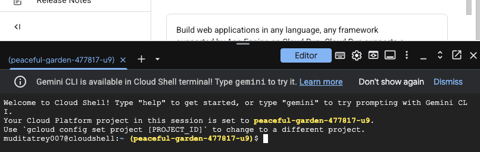

**What's happening:**
- This shows Google Cloud Shell, a browser-based terminal environment
- Welcome message: "Welcome to Cloud Shell! Type 'help' to get started"
- **New feature:** Gemini CLI is available - type `gemini` to try it
- The session is automatically set to project: `peaceful-garden-477817-u9`
- Cloud Shell provides a pre-configured environment with gcloud CLI already installed

**Note:** Cloud Shell is an alternative to local SDK installation, accessible directly from the browser.

---

## 13. gcloud Initialization

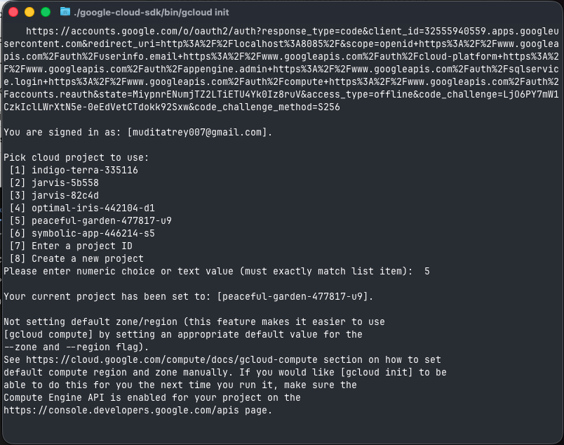

**What's happening:**
- The OAuth authorization URL is displayed (long authentication URL)
- User confirmation: "You are signed in as: [muditatreya07@gmail.com]"
- **Project selection menu** displayed with multiple projects:
  1. indigo-terra-335116
  2. jarvis-5b558
  3. jarvis-82c4d
  4. optimal-inis-442104-d1
  5. **peaceful-garden-477817-u9** ← Selected (option 5)
  6. symbolic-app-446214-s5
  7. Enter a project ID
  8. Create a new project
- Confirmation: "Your current project has been set to: [peaceful-garden-477817-u9]"
- Note about default zone/region settings and Compute Engine API

**Action Completed:** The gcloud CLI is now configured to use the correct project.

---

## 14. Creating the Application Code

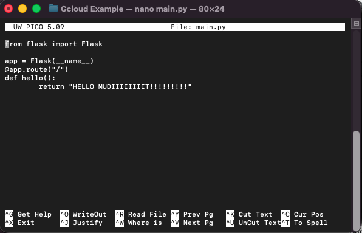

**What's happening:**
- Creating `main.py` using nano text editor
- **Application code:**
  ```python
  from flask import Flask
  
  app = Flask(__name__)
  
  @app.route("/")
  def hello():
      return "HELLO MUDIIIIIIIIT!!!!!!!!!"
  ```
- This is a simple Flask web application with a single route that returns a greeting message
- The bottom of the screen shows nano editor controls

**Purpose:** This is your actual application code that will run on App Engine.

---

## 15. Defining Dependencies

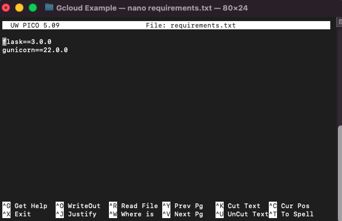

**What's happening:**
- Creating `requirements.txt` using nano
- **Contents:**
  ```
  Flask==3.0.0
  gunicorn
  ```
- **Flask==3.0.0:** The web framework for your Python application
- **gunicorn:** A Python WSGI HTTP Server that will serve your Flask application in production

**Purpose:** This file tells App Engine which Python packages to install when deploying your application.

---

## 16. App Engine Configuration

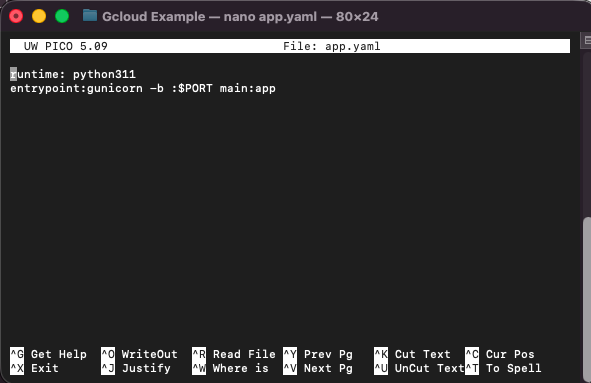

**What's happening:**
- Creating `app.yaml` using nano
- **Configuration:**
  ```yaml
  runtime: python311
  entrypoint: gunicorn -b :$PORT main:app
  ```
- **runtime: python311** - Specifies Python 3.11 as the runtime environment
- **entrypoint** - Defines the command to start your application:
  - Uses `gunicorn` web server
  - Binds to port specified by `$PORT` environment variable
  - Points to the `app` object in `main.py`

**Purpose:** This file is required by App Engine to know how to run your application.

---

## 17. Starting gcloud init


**What's happening:**
- Running the command: `./google-cloud-sdk/bin/gcloud init`
- A helpful tip is shown: "Run 'gcloud cheat-sheet' to see a roster of go-to 'gcloud' commands"
- This command starts the initialization process to configure the gcloud CLI

**Note:** The user is running gcloud from the extracted SDK directory path.

---

## 18. gcloud Authentication

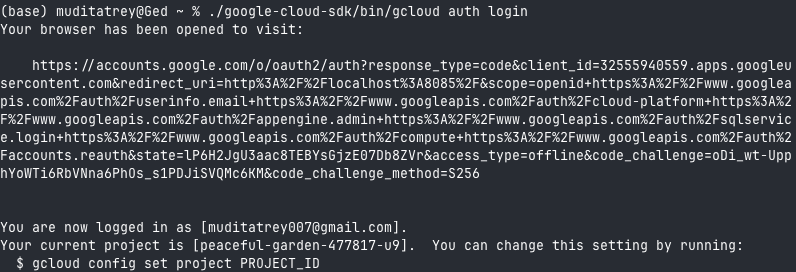

**What's happening:**
- Running: `./google-cloud-sdk/bin/gcloud auth login`
- The browser has opened automatically for OAuth authentication
- Terminal shows a long OAuth URL that was opened
- **Success message:** "You are now logged in as [muditatreya07@gmail.com]"
- Current project confirmed: "Your current project is [peaceful-garden-477817-u9]"
- Helpful command shown to change projects: `gcloud config set project PROJECT_ID`

**Status:** Authentication successful - you can now use gcloud commands.

---

## 19. Configuring Project ID


**What's happening:**
- Running the command:
  ```bash
  ./google-cloud-sdk/bin/gcloud config set project peaceful-garden-477817-u9
  ```
- This explicitly sets the active project for all subsequent gcloud commands

**Purpose:** Ensures all future commands target the correct Google Cloud project.

---

## 20. Project Set Successfully

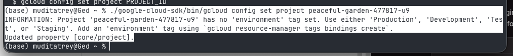

**What's happening:**
- The command from the previous step completed successfully
- **Information message:** "Project 'peaceful-garden-477817-u9' has no 'environment' tag set"
- Suggestion to use tags: 'Production', 'Development', 'Test', or 'Staging'
- You can add tags using: `gcloud resource-manager tags bindings create`
- **Confirmation:** "Updated property [core/project]"

**Status:** Your gcloud configuration now points to the correct project.

---

## 21. Accessing Project Folder

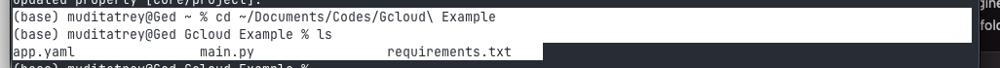

**What's happening:**
- Navigating to the project directory:
  ```bash
  cd ~/Documents/Codes/Gcloud\ Example
  ```
- Listing files with `ls` command shows:
  - `app.yaml` - App Engine configuration
  - `main.py` - Your Flask application code
  - `requirements.txt` - Python dependencies

**Status:** You're now in the directory containing all your application files, ready to deploy.

---

## 22. Deployment Process

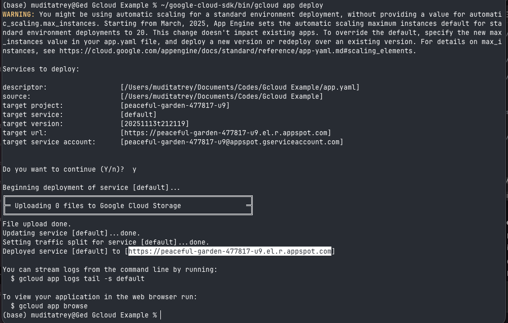

**What's happening:**
- Running: `~/google-cloud-sdk/bin/gcloud app deploy`
- **Warning about automatic scaling:** App Engine will set max_instances default to 20 starting March 2025
- **Deployment summary displayed:**
  - Descriptor: `/Users/muditatrey/Documents/Codes/Gcloud Example/app.yaml`
  - Target project: `peaceful-garden-477817-u9`
  - Target service: `default`
  - Target version: `20251113t212119` (timestamp-based)
  - Target URL: `https://peaceful-garden-477817-u9.el.r.appspot.com`
  - Service account: `peaceful-garden-477817-u9@appspot.gserviceaccount.com`
- User confirms with: "y"
- **Deployment steps:**
  1. "Uploading 3 files to Google Cloud Storage"
  2. "File upload done"
  3. "Updating service [default]...done"
  4. "Setting traffic split for service [default]"
  5. "Deployed service [default]"
- **Helpful commands provided:**
  - `gcloud app logs tail -s default` - Stream logs
  - `gcloud app browse` - Open in browser

**Status:** Deployment successful! Your application is now live.

---

## 23. App URL in Browser

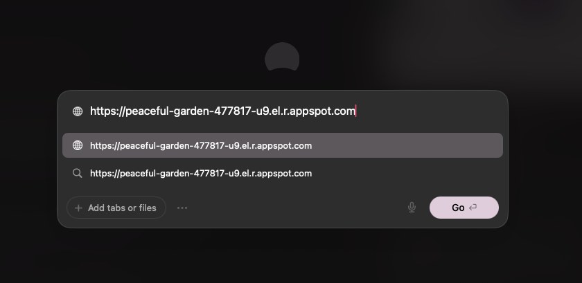

**What's happening:**
- Browser navigating to the deployed application URL
- URL: `https://peaceful-garden-477817-u9.el.r.appspot.com`
- The page is loading...

**Action:** Accessing your live application for the first time.

---

## 24. Hello World Success!


**What's happening:**
- **Success!** The application is running and displaying the message:
  ```
  HELLO MUDIIIIIIIIT!!!!!!!!!!!
  ```
- This is the exact string returned by your Flask application's `hello()` function
- Your application is now publicly accessible on the internet via the App Engine URL

**Achievement Unlocked:** You've successfully deployed your first application to Google App Engine!

---

## 25. App Engine Versions Dashboard

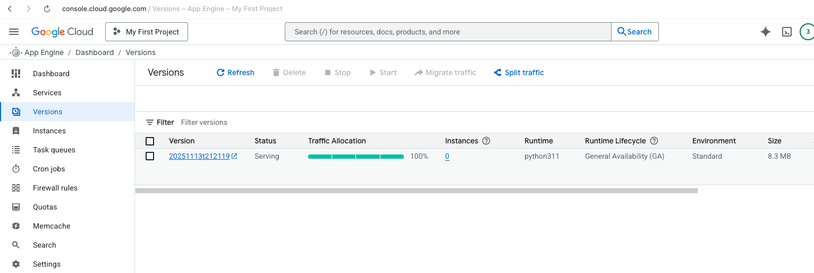

**What's happening:**
- Viewing the App Engine Versions dashboard in Google Cloud Console
- **Version details:**
  - Version: `20251113t212119` (timestamp from deployment)
  - Status: **Serving** (green indicator)
  - Traffic Allocation: **100%** (all traffic goes to this version)
  - Instances: 0 (no active instances at the moment)
  - Runtime: `python311`
  - Runtime Lifecycle: General Availability (GA)
  - Environment: Standard
  - Size: 8.3MB
- Available actions: Stop, Start, Migrate traffic, Split traffic

**Key Point:** The Versions dashboard allows you to manage multiple versions of your app and control traffic distribution.

---

## 26. App Engine Settings

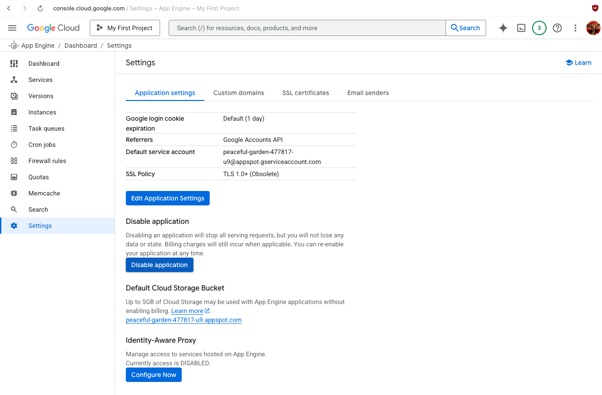

**What's happening:**
- Viewing the Settings page for your App Engine application
- **Application settings displayed:**
  - Google login cookie expiration: Default (1 day)
  - Referrers: Google Accounts API
  - Default service account: `peaceful-garden-477817-u9@appspot.gserviceaccount.com`
  - SSL Policy: TLS 1.0+ (Obsolete)
  - Edit Application Settings button available
- **Disable application section:**
  - Warning: "Disabling an application will stop all serving requests, but you will not lose any data or state"
  - Note: "Billing charges will still incur when applicable"
  - You can re-enable at any time
- **Default Cloud Storage Bucket:**
  - Free: Up to 5GB without enabling billing
  - Bucket: `peaceful-garden-477817-u9.appspot.com`
- **Identity-Aware Proxy:** Currently DISABLED

**Purpose:** This page manages global settings for your App Engine application.

---

## 27. Disable Confirmation

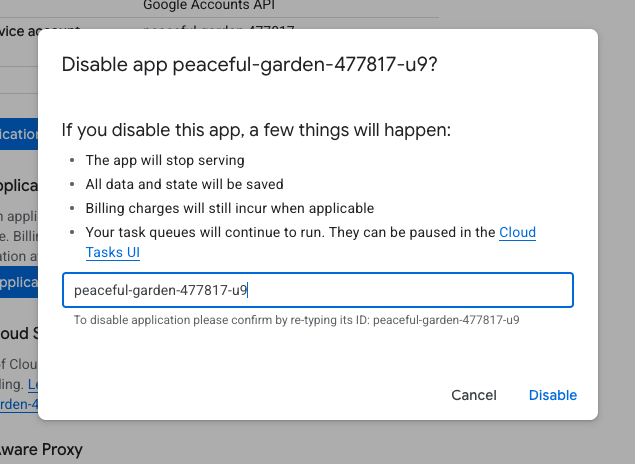

**What's happening:**
- A modal dialog has appeared asking: "Disable app peaceful-garden-477817-u9?"
- **Important information about disabling:**
  - ✓ The app will stop serving
  - ✓ All data and state will be saved
  - ✓ Billing charges will still incur when applicable
  - ⚠ Task queues will continue to run (can be paused separately)
- **Confirmation required:** You must re-type the project ID `peaceful-garden-477817-u9` to confirm
- This prevents accidental disabling of your application

**Security Feature:** The typed confirmation ensures you really want to disable the application.

---

## 28. Application Disabled

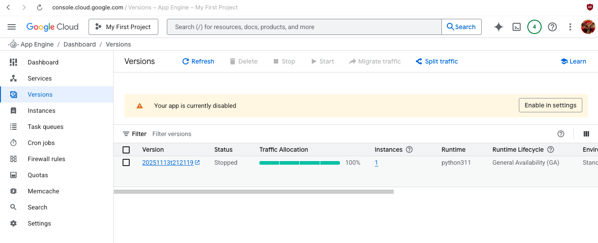

**What's happening:**
- The Versions dashboard now shows: **"Your app is currently disabled"**
- Version `20251113t212119` status has changed to: **Stopped** (grey indicator)
- Traffic Allocation still shows 100% (but no traffic is actually being served)
- A button appears: **"Enable in settings"** to restart the application
- All other version details remain the same (Runtime: python311, Environment: Standard)

**Status:** The application is no longer serving requests but can be re-enabled at any time from the Settings page.

---

## Summary

Congratulations! You've completed the full walkthrough of creating, deploying, and managing a Google App Engine application. Here's what you accomplished:

1. ✅ Created an App Engine application in Google Cloud Console
2. ✅ Installed and configured Google Cloud SDK
3. ✅ Authenticated with your Google account
4. ✅ Created a simple Flask web application
5. ✅ Configured App Engine deployment files
6. ✅ Deployed your application to App Engine
7. ✅ Verified the application is running
8. ✅ Explored the App Engine dashboard and settings
9. ✅ Learned how to disable/enable your application

## Key Files Created

- **main.py** - Your Flask application code
- **requirements.txt** - Python dependencies (Flask, gunicorn)
- **app.yaml** - App Engine configuration

## Essential Commands

```bash
# Install and configure SDK
./google-cloud-sdk/install.sh
gcloud init
gcloud auth login

# Set project
gcloud config set project PROJECT_ID

# Deploy application
gcloud app deploy

# View logs
gcloud app logs tail -s default

# Open in browser
gcloud app browse
```

---

*Tutorial created based on screenshots from creating a first Google App Engine project.*
