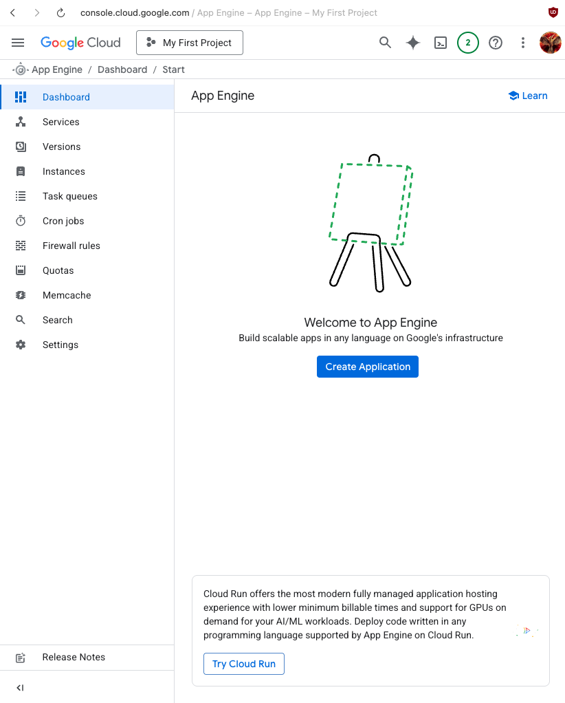
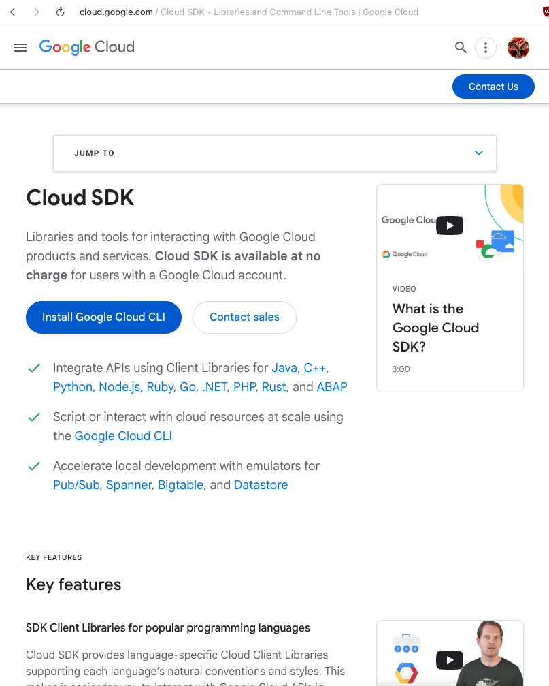
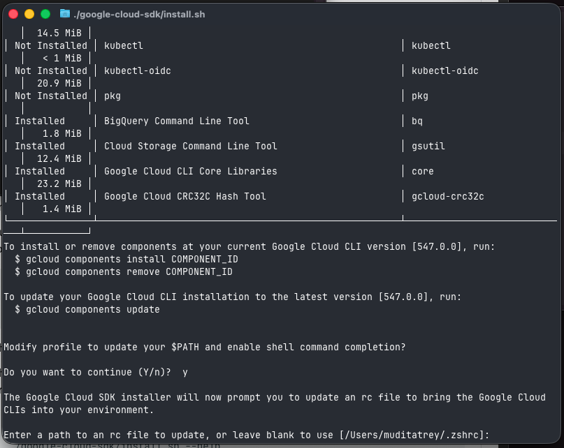
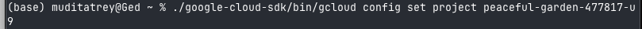

# Your First App on Google App Engine - Easy Tutorial

This tutorial will walk you through creating and hosting your first (and simple) app on Google App Engine.

## What We're Doing

We're going to:
- Set up Google App Engine (it's free to start)
- Install some tools on your computer
- Make a simple web app
- Put it on the internet
- See it work

Let's start.

<div style="page-break-after: always;"></div>

---

## Step 1: Starting with App Engine



This is Google Cloud Console looking at the App Engine. This is where you basically manage everything.

---

## Step 2: Creating Your App


Now we're creating the app. 

**IMPORTANT:** You need to select a region where your app will be hosted (like US, Europe, Asia, etc). **You cannot change this later**, so choose the region closest to where you or your users are located.

You also need to select a service account. Just use the default one.

---

## Step 3: Picking the Service Account


A dialog box appears asking about service accounts. Service accounts define what permissions your app has.

Select "App Engine default service account". It's already configured and ready to use.

---

## Step 4: Creating... Please Wait


The application is being created. This takes a minute or two.

---

## Step 5: App Created! Now What?


Your App Engine application is ready. 

It shows:
- Language: Python (what we're using)
- Environment: Standard 

To deploy your code, you need the Google Cloud SDK installed on your computer. This is software that lets you interact with Google Cloud from your terminal.

The commands shown (`gcloud init` and `gcloud app deploy`) are what we'll use later.

---

## Step 6: Getting the SDK



This is the download page for Google Cloud SDK. It's a set of tools that let you interact with Google Cloud from your computer's terminal.

Download it for your operating system. If you're on Mac with an M1/M2 chip, get the "darwin-arm" version. If you're on Windows or Linux, get the appropriate version.

---

## Step 7: Extracting the Download


After downloading, you need to extract the files. Run this command:

```bash
tar -xf /Users/muditatrey/Downloads/google-cloud-cli-darwin-arm.tar.gz
```

This creates a folder called `google-cloud-sdk` in your home directory where all the tools are located.

---

## Step 8: Installing the SDK


Run the install script:

```bash
./google-cloud-sdk/install.sh
```

It will ask if you want to help improve the tool by sending anonymous usage data. You can answer "n" for no or "y" for yes. This is optional.

---

## Step 9: What Gets Installed


The installer shows all the components. Some are installed by default:
- `bq` - for BigQuery
- `gsutil` - for Cloud Storage
- `core` - the main libraries
- `gcloud-crc32c` - a hash tool

The default installation is sufficient for what we need.

---

## Step 10: Adding to Your PATH



The installer asks if it should modify your shell profile so you can run `gcloud` from anywhere. Answer "y" for yes.

If you're on Mac with zsh (the default shell), just press enter when it asks for the rc file path. It will use `.zshrc` automatically.

**Important:** After this finishes, close your terminal and open a new one so the changes take effect.

---

## Step 11: Authentication Done


This page appears in your browser confirming you're authenticated. You've given your computer permission to access your Google Cloud account.

You can close this tab.

---

## Step 12: Cloud Shell (Optional)


This is Cloud Shell. It's a terminal that runs in your browser. You don't need this since we installed the SDK on your computer, but it's useful to know it exists. 

You can use Cloud Shell if you ever need to run commands without accessing your local machine.

---

## Step 13: Choosing Your Project


When you run `gcloud init`, it shows all your Google Cloud projects and asks which one to use. 

In this example, option 5 was selected: "peaceful-garden-477817-u9". Your project name will be different.

Type the number of your project and press enter.

---

## Step 14: Writing Your App Code


Now we write the actual app. Create a file called `main.py`:

```python
from flask import Flask

app = Flask(__name__)

@app.route("/")
def hello():
    return "HELLO MUDIIIIIIIIT!!!!!!!!!"
```

This is a simple Flask app that displays a message when you visit it. Flask is a web framework for Python that makes building web apps easier.

You can change the message to whatever you want.

---

## Step 15: Listing Dependencies


Create a file called `requirements.txt`:

```
Flask==3.0.0
gunicorn
```

This tells Google Cloud what Python packages to install. We need Flask and gunicorn. Gunicorn is a server that runs the app in production.

---

## Step 16: App Engine Config


Create the last file called `app.yaml`:

```yaml
runtime: python311
entrypoint: gunicorn -b :$PORT main:app
```

This tells App Engine:
- Use Python 3.11
- Start the app using gunicorn

The `$PORT` variable is important. App Engine uses this to tell your app which port to listen on.

---

## Step 17: Running gcloud init


Back to the terminal. Run:

```bash
./google-cloud-sdk/bin/gcloud init
```

This sets up the configuration. Once gcloud is in your PATH, you can just type `gcloud init` without the full path.

---

## Step 18: Logging In


Run:

```bash
./google-cloud-sdk/bin/gcloud auth login
```

This opens your browser to login with your Google account. After logging in, you'll see confirmation in the terminal.

---

## Step 19: Setting the Project



To make sure everything points to the right project, run:

```bash
./google-cloud-sdk/bin/gcloud config set project peaceful-garden-477817-u9
```

Replace with your actual project ID.

---

## Step 20: Project Set


You'll see "Updated property [core/project]" which means it worked.

The message about environment tags is optional and can be ignored.

---

## Step 21: Go to Your Project Folder


Navigate to where you saved your three files:

```bash
cd ~/Documents/Codes/Gcloud\ Example
```

Run `ls` to verify you have:
- `app.yaml`
- `main.py`
- `requirements.txt`

All three files should be there.

---

## Step 22: Deploy Time


Run:

```bash
~/google-cloud-sdk/bin/gcloud app deploy
```

It shows a summary of what it's about to do and asks "Do you want to continue (Y/n)?" 

Type `y` and press enter.

It will upload your files, install the dependencies, and deploy everything. This takes a minute or two. You'll see:
- "Uploading 3 files..."
- "File upload done"
- "Updating service..."
- "Deployed service [default]"

At the end it gives you a URL. That's your app.

---

## Step 23: Opening Your App


Copy the URL and paste it in your browser. It will look something like:

`https://peaceful-garden-477817-u9.el.r.appspot.com`

The page is loading.

---

## Step 24: It Works


Your message appears on the internet.

Your app is now live. Anyone in the world can visit that URL and see it.

---

## Step 25: Checking the Dashboard


Back in the Cloud Console, go to the Versions page. You can see:
- Your version (it uses a timestamp as the name)
- Status: **Serving** (green means it's running)
- Traffic: 100% (all visitors go to this version)
- Runtime: python311
- Size: 8.3MB

If you deploy again later, you'll have multiple versions here. You can switch between them.

---

## Step 26: Looking at Settings


The Settings page shows more information about your app. Most of these settings don't need to be changed.

One important thing: the "Disable application" button. This is how you turn off your app. Note that even when disabled, you might still incur some charges.

---

## Step 27: Disabling Your App


If you click the Disable button, you must type the project ID to confirm. This prevents accidental shutdowns.

When you disable the app:
- It stops serving requests (nobody can visit it)
- Your data stays saved
- You can turn it back on anytime
- You might still get some charges

---

## Step 28: App is Disabled


The dashboard now shows "Your app is currently disabled" and the status is **Stopped** (grey).

You can enable it again from the settings page.

---

## Summary

You've deployed a real app to Google Cloud. It's a simple app, but the process is the same for bigger, more complex applications.

### What You Learned:
- How to set up App Engine
- Installing Google Cloud SDK
- Creating a Flask app
- Deploying with gcloud
- Managing your app in the dashboard

### The Three Important Files:
1. **main.py** - Your app code
2. **requirements.txt** - What packages to install
3. **app.yaml** - Configuration for App Engine

### Main Commands to Remember:
```bash
gcloud init              # Setup
gcloud auth login        # Login to Google
gcloud app deploy        # Deploy your app
gcloud app browse        # Open your app in a browser
gcloud app logs tail     # See live logs
```

---

**Note:** When you're done and don't need the app anymore, disable it (or delete the project) so you don't get charged for resources you're not using.
